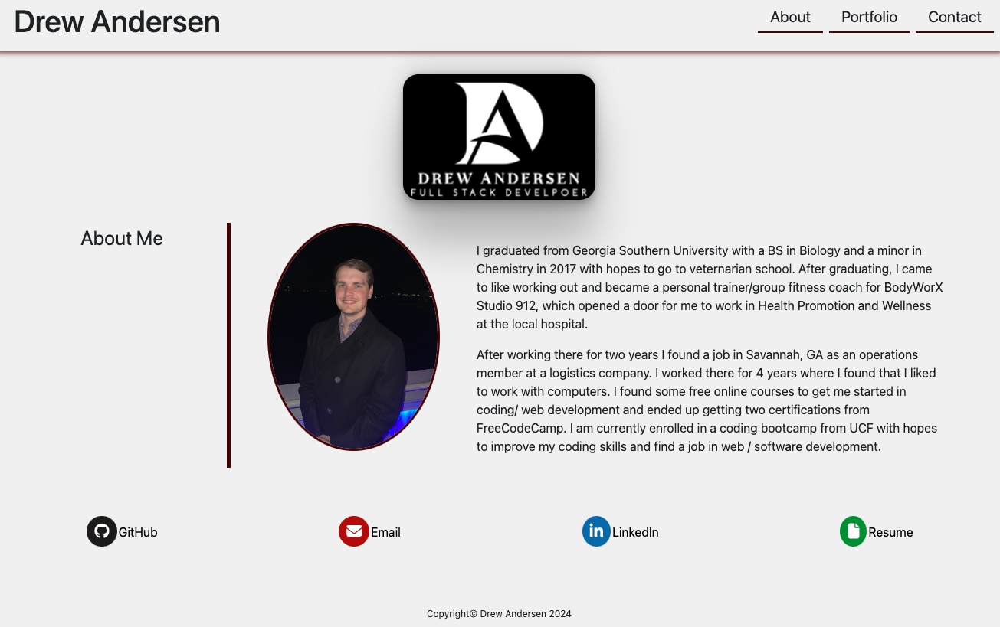

# React Portfolio

## Table of Contents

- [Description](#description)

- [Live-URL](#live-url)

- [Screenshots](#screenshots)

- [Technologies-Used](#technologies-used)

- [Installation](#installation)

- [Suggested-Future-Development](#suggested-future-development)

- [License](#license)

- [Questions](#questions)

## Description

This is portfolio application that was developed to showcase my full stack developer skills. It was created using React.js, an open sourced JavaScript library for building user interfaces, Bootstrap, and Font Awesome, for future development of the hamburger menu for smaler devices. React was created by Facebook developers and helps simplify the process of building UI by providing a component-based structure, efficient rendering through virtual DOM, and a declarative syntax. 

## Live URL

[Link to Drew Andersen's Portfolio](https://drewandersen-portfolio.netlify.app)

## Screenshots

## Technologies Used

This application is powered by React.js (v18.3.1). Bootstrap (v5.3.3) and custom CSS were utilized to create the overall styling of the UI.

## Installation

- Users can use this application by going to the live site at https://drewandersen-portfolio.netlify.app.

## Usage

This application is very user intuitive, just visit the site (https://drewandersen-portfolio.netlify.app), navigate through different pages using the links in the nav-bar, and view desired content.

## Suggested Future Development

- Toggle for Dark and Light Themes
- Continued display and UI development
- Burger Menu for smaller devices
- Add addition of useEffect

## License

## Questions

Have additional questions? Click the links below to reach me through my GitHub account or Email address.

[Link to Github](https://github.com/drew-andersen)

<a href="mailto:andrewtandersen@gmail.com">andrewtandersen@gmail.com</a>
