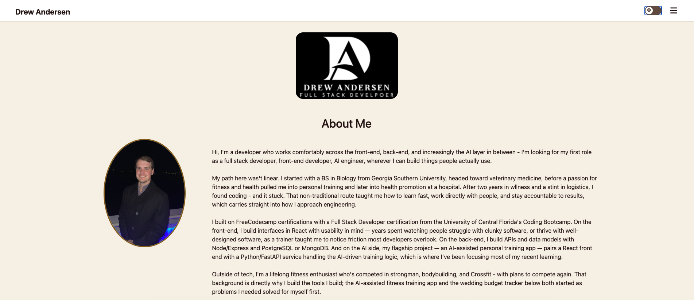

# React Portfolio
 
## Table of Contents
 
- [Description](#description)
- [Live-URL](#live-url)
- [Screenshots](#screenshots)
- [Technologies-Used](#technologies-used)
- [Installation](#installation)
- [Suggested-Future-Development](#suggested-future-development)
- [License](#license)
- [Questions](#questions)
## Description
 
This is a portfolio application developed to showcase my full stack developer skills. It was built using React.js, an open source JavaScript library for building user interfaces, along with Bootstrap and Font Awesome for icons and styling, including the hamburger navigation menu and light/dark theme toggle. 
 
## Live URL
 
[Link to Drew Andersen's Portfolio](https://drewandersen.dev)
 
## Screenshots
 

 
## Technologies Used
 
This application is powered by React.js (v18.3.1). Bootstrap (v5.3.3), Font Awesome, and custom CSS were utilized to create the overall styling of the UI.
 

 
## Installation
 
- Users can use this application by going to the live site at https://drewandersen.dev.
## Usage
 
This application is very user intuitive, just visit the site (https://drewandersen.dev), navigate through different pages using the links in the nav-bar, and view desired content.
 
## Suggested Future Development
 
- Add real screenshots for the AI Personal Trainer project
- Add meta description and Open Graph tags for SEO and link previews
- Continued display and UI development
- Reconcile listed tech stack across resume and portfolio

## License
 

 
## Questions
 
Have additional questions? Click the links below to reach me through my GitHub account or Email address.
 
[Link to Github](https://github.com/drew-andersen)
 
<a href="mailto:andrewtandersen@gmail.com">andrewtandersen@gmail.com</a>